# My Personal AI Assistant Project - Lumina 👨🏻‍💻

**David Nguyen's Personal AI Assistant** - **Lumina** is a full-stack web application that allows users to ask questions about David Nguyen, as well as any other topics, and receive instant, personalized responses powered by state‑of‑the‑art AI & RAG. Users can log in to save their conversation history or continue as guests. The app uses modern technologies and provides a sleek, responsive user interface with lots of animations. 🚀

<p align="center">
  
</p>

## Table of Contents

- [Live App](#live-app)
  - [Key Technologies](#key-technologies)
- [Features](#features)
- [Architecture](#architecture)
  - [High-Level Architecture Flow Diagram](#high-level-architecture-flow-diagram)
- [Setup & Installation](#setup--installation)
  - [Backend Setup](#backend-setup)
  - [Frontend Setup](#frontend-setup)
- [Deployment](#deployment)
- [Usage](#usage)
- [User Interface](#user-interface)
- [API Endpoints](#api-endpoints)
  - [Authentication](#authentication)
  - [Conversations](#conversations)
  - [Chat](#chat)
  - [Swagger API Documentation](#swagger-api-documentation)
- [Project Structure](#project-structure)
- [Dockerization](#dockerization)
- [OpenAPI Specification](#openapi-specification)
- [Contributing](#contributing)
- [License](#license)

## Live App

Currently, the app is deployed live on Vercel at: [https://lumina-david.vercel.app/](https://lumina-david.vercel.app). Feel free to check it out!

For the backend (with Swagger docs), it is deployed live also on Vercel at: [https://ai-assistant-chatbot-server.vercel.app/](https://ai-assistant-chatbot-server.vercel.app/).

Alternatively, the backup app is deployed live on Netlify at: [https://lumina-ai-chatbot.netlify.app/](https://lumina-ai-chatbot.netlify.app/).

### Key Technologies


## Features

- **AI Chatbot:** Ask questions about David Nguyen and general topics; receive responses from an AI.
- **User Authentication:** Sign up, log in, and log out using JWT authentication.
- **Conversation History:** Save, retrieve, rename, and search past conversations (only for authenticated users).
- **Updated & Vast Knowledge Base:** Use RAG (Retrieval-Augmented Generation) & LangChain to enhance AI responses.
- **Dynamic Responses:** AI-generated responses with `markdown` formatting for rich text.
- **Interactive Chat:** Real-time chat interface with smooth animations and transitions.
- **Reset Password:** Verify email and reset a user’s password.
- **Responsive UI:** Built with React and Material‑UI (MUI) with a fully responsive, modern, and animated interface.
- **Landing Page:** A dynamic landing page with animations, feature cards, and call-to-action buttons.
- **Guest Mode:** Users may interact with the AI assistant as a guest, though conversations will not be saved.
- **Dark/Light Mode:** Users can toggle between dark and light themes, with the preference stored in local storage.

## Architecture

The project is divided into two main parts:

- **Backend:**  
  An Express server written in TypeScript. It provides endpoints for:

  - User authentication (signup, login).
  - Conversation management (create, load, update, and search conversations).
  - AI chat integration (simulated calls to external generative AI APIs).
  - Additional endpoints for email verification and password reset.
  - MongoDB is used for data storage, with Mongoose for object modeling.

- **Frontend:**  
  A React application built with TypeScript and Material‑UI (MUI). It includes:

  - A modern, animated user interface for chatting with the AI.
  - A landing page showcasing the app’s features.
  - Pages for login, signup, and password reset.
  - A collapsible sidebar for conversation history.
  - Theme toggling (dark/light mode) and responsive design.

- **AI/ML:**
  Use RAG (Retrieval-Augmented Generation) & LangChain to enhance the AI's responses by retrieving relevant information from a knowledge base or external sources. This involves:

  - Retrieval: Implement a retrieval mechanism to fetch relevant documents or data from a knowledge base or external sources.
  - Augmentation: Combine the retrieved information with the user's query to provide a more informed response.
  - Generation: Use a generative model to create a response based on the augmented input.
  - Feedback Loop: Implement a feedback loop to continuously improve the system based on user interactions and feedback.
  - LangChain: Use LangChain to manage the entire process, from retrieval to generation, ensuring a seamless integration of RAG into the chatbot's workflow.
  - Pinecone: Use Pinecone for vector similarity search to efficiently retrieve relevant documents or data for the RAG model.

### High-Level Architecture Flow Diagram

```plaintext
         ┌─────────────────────────────┐
         │      User Interaction       │
         │ (Chat, Signup, Login, etc.) │
         └─────────────┬───────────────┘
                       │
                       ▼
         ┌─────────────────────────────┐
         │    Frontend (React + MUI)   │
         │ - Responsive UI, Animations │
         │ - Theme toggling, Sidebar   │
         │ - API calls to backend      │
         └─────────────┬───────────────┘
                       │
                       │ (REST API Calls)
                       │
                       ▼
         ┌─────────────────────────────┐
         │   Backend (Express + TS)    │
         │ - Auth (JWT, Signup/Login)  │
         │ - Chat & Convo Endpoints    │
         │ - API orchestration         │
         └─────────────┬───────────────┘
                       │
           ┌───────────┴────────────┬─────────────┐
           │                        │             │
           ▼                        ▼             ▼
┌─────────────────┐       ┌─────────────────┐  ┌─────────────────────────┐
│   MongoDB       │       │ Pinecone Vector │  │  (Additional Data:      │
│ - User Data     │◄─────►│    Database     │  │  Analytics, Logs, etc.) │
│ - Convo History │       │ - Upserted Docs │  └────────────┬────────────┘
└─────────────────┘       │   /Knowledge    │               │
       ▲                  │     Base        │               ▼
       │                  └─────────┬───────┘      ┌─────────────────┐
       │                            │              │   Analytics &   │
       │    (Uses stored convo      │              │   Monitoring    │
       │       & documents)         │              │   Services      │
       ▼                            ▼              └─────────────────┘
       ┌───────────────────────────────┐
       │  AI/ML Component (RAG)        │
       │ - Retrieval (Pinecone &       │
       │   MongoDB conversation data)  │
       │ - Augmentation (LangChain)    │
       │ - Generation (OpenAI API)     │
       │ - Feedback loop               │
       └───────────────┬───────────────┘
                       │
                       ▼
         ┌─────────────────────────────┐
         │   Response Processing       │
         │ - Compile AI answer         │
         | - Uses NLP & ML models      │
         │ - Generate response with    │
         │   LLM & Gemini AI           │
         │ - Update conversation data  │
         │   (MongoDB via Backend)     │
         └─────────────┬───────────────┘
                       │
                       │ (Returns API response)
                       │ (skip AI/ML for login/signup)
                       │
                       ▼
         ┌─────────────────────────────┐
         │    Frontend Display         │
         │ - Show chat response        │
         │ - Update UI (convo history) │
         │ - Sign user in/out, etc.    │
         └─────────────────────────────┘
```

## Setup & Installation

### Backend Setup

1. **Clone the repository:**

   ```bash
   git clone https://github.com/hoangsonww/AI-Assistant-Chatbot.git
   cd AI-Assistant-Chatbot/server
   ```

2. **Install dependencies:**

   ```bash
   npm install
   ```

3. **Environment Variables:**  
   Create a `.env` file in the `server` folder with the following (adjust values as needed):

   ```env
   PORT=5000
   MONGODB_URI=mongodb://localhost:27017/ai-assistant
   JWT_SECRET=your_jwt_secret_here
   GOOGLE_AI_API_KEY=your_google_ai_api_key_here
   AI_INSTRUCTIONS=Your system instructions for the AI assistant
   PINECONE_API_KEY=your_pinecone_api_key_here
   PINECONE_INDEX_NAME=your_pinecone_index_name_here
   ```

4. **Run the server in development mode:**

   ```bash
   npm run dev
   ```

   This uses nodemon with `ts-node` to watch for file changes.

### Frontend Setup

1. **Navigate to the client folder:**

   ```bash
   cd ../client
   ```

2. **Install dependencies:**

   ```bash
   npm install
   ```

3. **Run the frontend development server:**

   ```bash
   npm start
   ```

   The app will run on [http://localhost:3000](http://localhost:3000) (or any other port you've specified in the `.env` file's `PORT` key).

### AI/ML Setup

1. Install necessary Node.js packages:

   ```bash
   npm install
   ```

2. Store knowledge data in Pinecone vector database:

   ```bash
   npm run store
   ```

   Or

   ```bash
   ts-node server/src/scripts/storeKnowledge.ts
   ```

3. Ensure you run this command before starting the backend server to store the knowledge data in the Pinecone vector database.

## Deployment

- **Backend:**  
  Deploy the backend to your preferred Node.js hosting service (Heroku, AWS, etc.). Make sure to set your environment variables on the hosting platform.

- **Frontend:**  
  Deploy the React frontend using services like Vercel, Netlify, or GitHub Pages. Update API endpoint URLs in the frontend accordingly.

## Usage

- **Landing Page:**  
  The landing page provides an overview of the app’s features and two main actions: Create Account (for new users) and Continue as Guest.

- **Authentication:**  
  Users can sign up, log in, and reset their password. Authenticated users can save and manage their conversation history.

- **Chatting:**  
  The main chat area allows users to interact with the AI assistant. The sidebar displays saved conversations (for logged-in users) and allows renaming and searching.

- **Theme:**  
  Toggle between dark and light mode via the navbar. The chosen theme is saved in local storage and persists across sessions.

## User Interface

### Landing Page

<p align="center">
  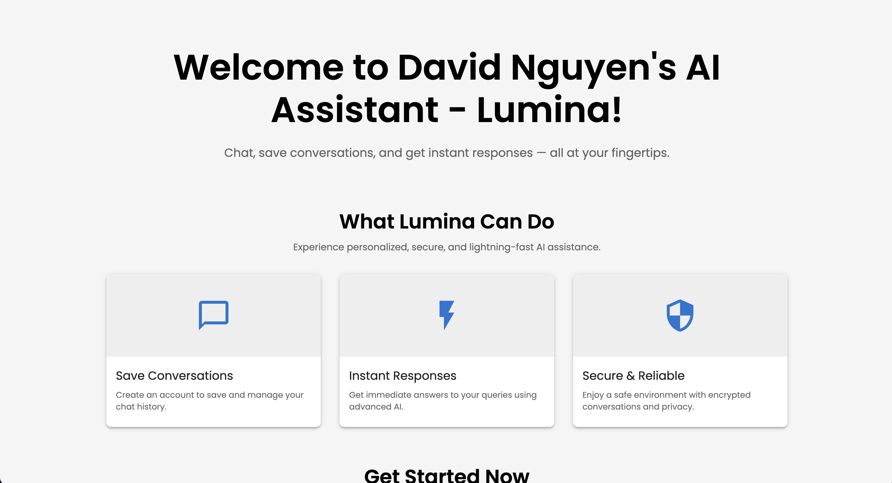
</p>

#### Landing Page - Dark Mode

<p align="center">
  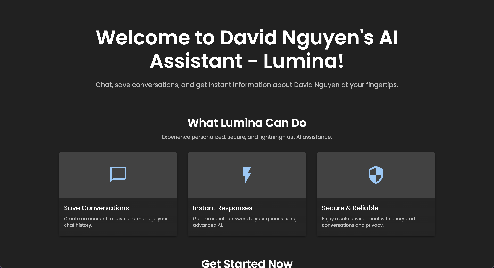
</p>

### Homepage

<p align="center">
  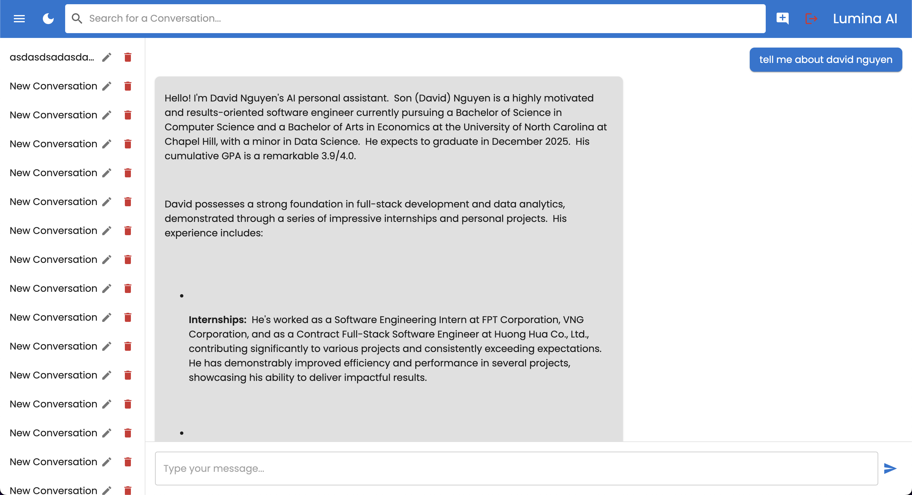
</p>

#### Homepage - Dark Mode

<p align="center">
  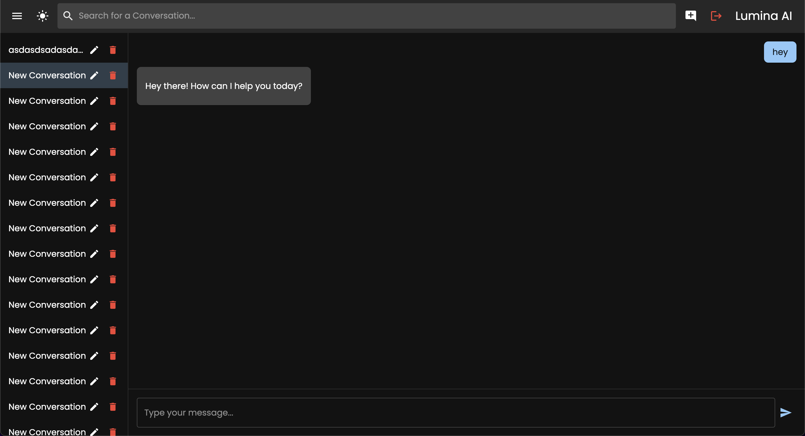
</p>

### Login Page

<p align="center">
  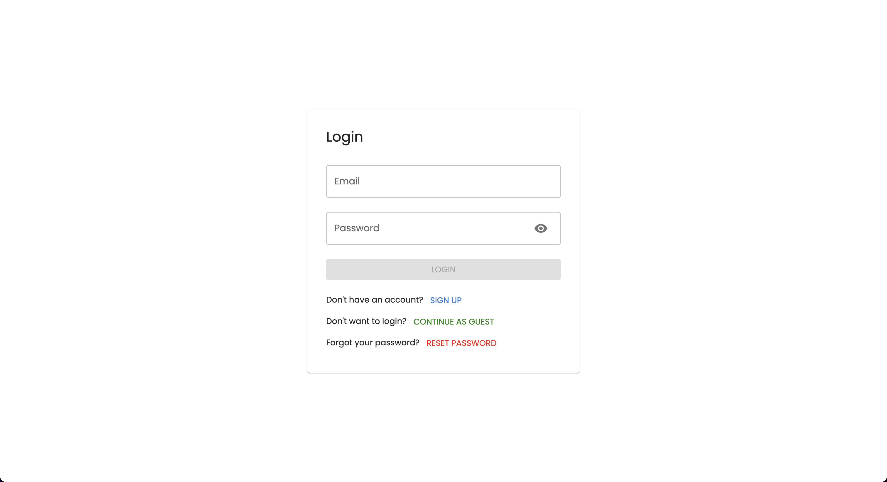
</p>

#### Login Page - Dark Mode

<p align="center">
  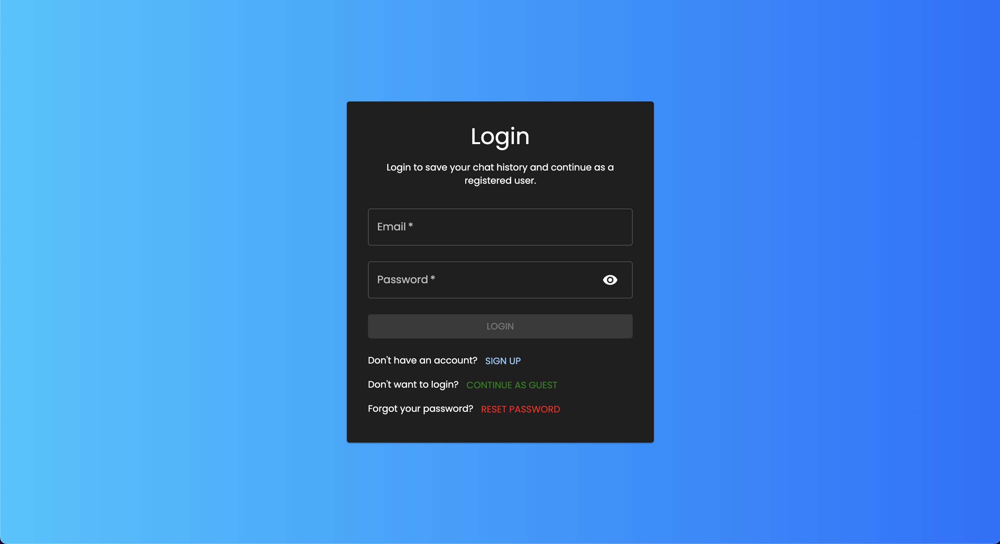
</p>

### Signup Page

<p align="center">
  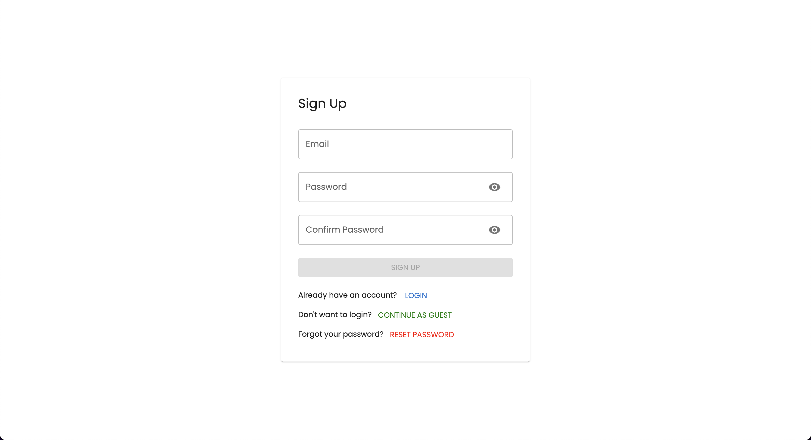
</p>

#### Signup Page - Dark Mode

<p align="center">
  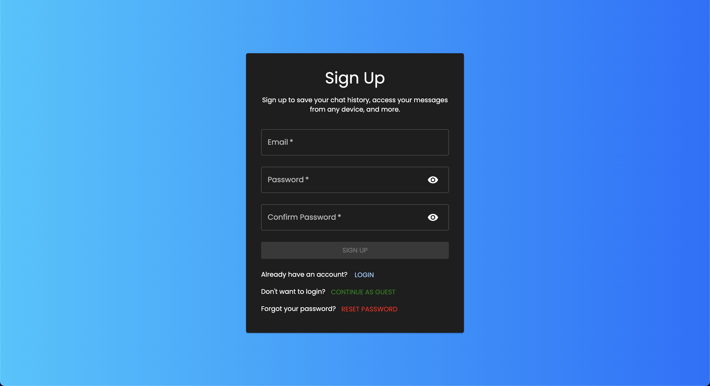
</p>

### Reset Password Page

<p align="center">
  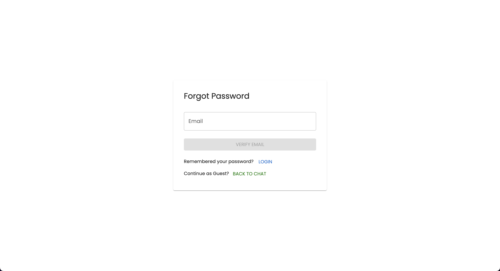
</p>

#### Reset Password Page - Dark Mode

<p align="center">
  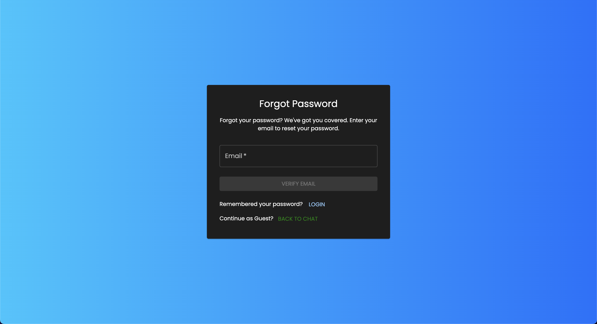
</p>

### Homepage - Unauthenticated User

<p align="center">
  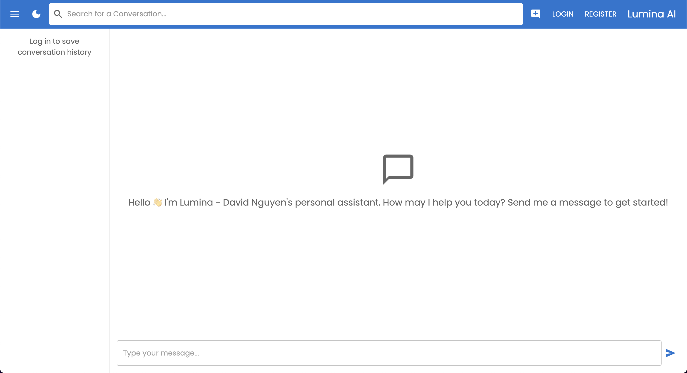
</p>

#### Homepage - Unauthenticated User - Dark Mode

<p align="center">
  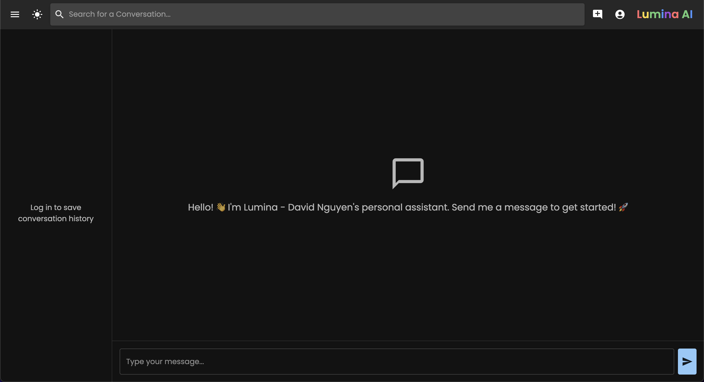
</p>

### 404 Page

<p align="center">
  
</p>

## API Endpoints

### Authentication

- **POST /api/auth/signup:** Create a new user.
- **POST /api/auth/login:** Authenticate a user and return a JWT.
- **GET /api/auth/verify-email?email=example@example.com:** Check if an email exists.
- **POST /api/auth/reset-password:** Reset a user's password.

### Conversations

- **POST /api/conversations:** Create a new conversation.
- **GET /api/conversations:** Get all conversations for a user.
- **GET /api/conversations/:id:** Retrieve a conversation by ID.
- **PUT /api/conversations/:id:** Rename a conversation.
- **GET /api/conversations/search/:query:** Search for conversations by title or message content.
- **DELETE /api/conversations/:id:** Delete a conversation.

### Chat

- **POST /api/chat:** Process a chat query and return an AI-generated response.

### Swagger API Documentation

<p align="center">
  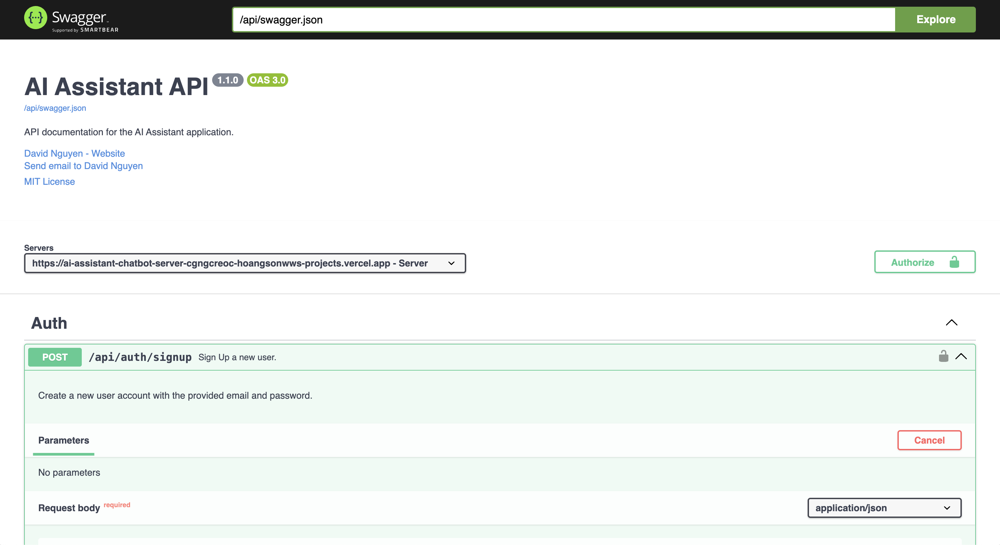
</p>

## Project Structure

```
AI-Assistant-Chatbot/
├── docker-compose.yml
├── openapi.yaml
├── README.md
├── LICENSE
├── Jenkinsfile
├── package.json
├── tsconfig.json
├── .env
├── shell/                          # Shell scripts for app setups
├── client/                         # Frontend React application
│   ├── package.json
│   ├── tsconfig.json
│   ├── docker-compose.yml
│   ├── Dockerfile
│   └── src/
│       ├── App.tsx
│       ├── index.tsx
│       ├── theme.ts
│       ├── dev/
│       │   ├── palette.tsx
│       │   ├── previews.tsx
│       │   ├── index.ts
│       │   └── useInitial.ts
│       ├── services/
│       │   └── api.ts
│       ├── types/
│       │   ├── conversation.d.ts
│       │   └── user.d.ts
│       ├── components/
│       │   ├── Navbar.tsx
│       │   ├── Sidebar.tsx
│       │   └── ChatArea.tsx
│       └── pages/
│           ├── LandingPage.tsx
│           ├── Home.tsx
│           ├── Login.tsx
│           ├── Signup.tsx
│           ├── NotFoundPage.tsx
│           └── ForgotPassword.tsx
└── server/                         # Backend Express application
    ├── package.json
    ├── tsconfig.json
    ├── Dockerfile
    ├── docker-compose.yml
    └── src/
        ├── server.ts
        ├── models/
        │   ├── Conversation.ts
        │   └── User.ts
        ├── routes/
        │   ├── auth.ts
        │   ├── conversations.ts
        │   └── chat.ts
        ├── services/
        │   └── authService.ts
        ├── utils/
        │   └── ephemeralConversations.ts
        └── middleware/
            └── auth.ts
```

## Dockerization

To run the application using Docker, simply run `docker-compose up` in the root directory of the project. This will start both the backend and frontend services as defined in the `docker-compose.yml` file.

**Why Dockerize?**

- **Consistency:** Ensures the application runs the same way in different environments.
- **Isolation:** Keeps dependencies and configurations contained.
- **Scalability:** Makes it easier to scale services independently.
- **Simplified Deployment:** Streamlines the deployment process.
- **Easier Collaboration:** Provides a consistent environment for all developers.

## OpenAPI Specification

There is an OpenAPI specification file (`openapi.yaml`) in the root directory that describes the API endpoints, request/response formats, and authentication methods. This can be used to generate client SDKs or documentation.

To view the API documentation, you can use tools like Swagger UI or Postman to import the `openapi.yaml` file. Or just go to the `/docs` endpoint of the deployed backend.

## Contributing

1. Fork the repository.
2. Create your feature branch: `git checkout -b feature/your-feature-name`
3. Commit your changes: `git commit -m 'Add some feature'`
4. Push to the branch: `git push origin feature/your-feature-name`
5. Open a Pull Request.

## License

This project is licensed under the [MIT License](LICENSE).

## Contact

If you have any questions or suggestions, feel free to reach out to me:

- **David Nguyen**
  - [LinkedIn](https://www.linkedin.com/in/hoangsonw/)
  - [GitHub](https://github.com/hoangsonww)
  - [Email](mailto:hoangson091104@gmail.com)

---

Thank you for checking out the AI Assistant Project! If you have any questions or feedback, feel free to reach out. Happy coding! 🚗

[⬆️ Back to Top](#table-of-contents)
